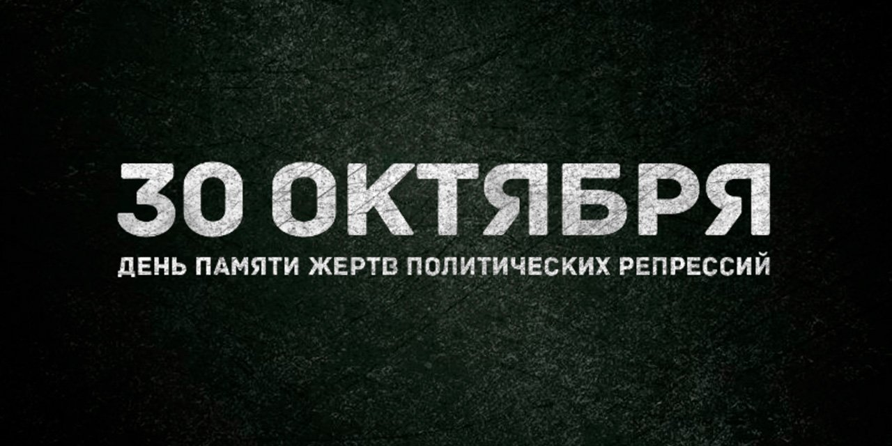

# 30 октября

*October 30*

Сайт ко Дню памяти жертв политических репрессий: список 13 448 человек, расстрелянных в Москве в 1937–1938 годах, и карта памятных мероприятий по всей России.

**[Открыть архив →](https://30october.gulagmemory.org)** · [Все сохранённые сайты](https://gulagmemory.org)

| | |
|:--|:--|
| **Тип** | Мемориальный проект |
| **Годы** | до ноября 2024 |
| **Исходный адрес** | `30october.ru` |
| **Адрес архива** | [30october.gulagmemory.org](https://30october.gulagmemory.org) |
| **Снимок сделан** | февраль 2026 · `httrack` |

## О проекте

> Хотелось бы всех поимённо назвать,
> Да отняли список, и негде узнать.
>
> — Анна Ахматова, «Реквием»

Проект напоминал о Дне памяти жертв политических репрессий и собирал в одном месте информацию о мероприятиях 30 октября в разных регионах России. Главная страница — поимённый список 13 448 человек, расстрелянных в Москве в 1937–1938 годах; список предоставило общество «Мемориал».

Отдельная страница рассказывает историю даты: День политзаключённого придумали в 1974 году узники мордовских лагерей Кронид Любарский и Алексей Мурженко — как день голодовок и открытых заявлений. В 1991 году 30 октября стало официальным Днём памяти жертв политических репрессий.

## Что сохранено

- полный список имён на главной странице;
- страницы «О проекте», «О 30 октября», «Партнёры»;
- карта мероприятий.

## Что не работает

- карта мероприятий зависит от Яндекс.Карт и может не загружаться.

---

Репозиторий входит в [реестр сохранённых сайтов Музея истории ГУЛАГа](https://gulagmemory.org) — некоммерческий архив цифрового наследия, созданный в исследовательских и образовательных целях. Права на тексты, фотографии, видео и другие материалы принадлежат их авторам и правообладателям.

<b>English</b>

### October 30

Website for the Day of Remembrance of the Victims of Political Repression (October 30): the names of 13,448 people shot in Moscow in 1937–1938 (list provided by Memorial), the history of the date, and a map of commemorative events across Russia.

**Type:** Memorial project · **Original address:** `30october.ru` · **Archive:** [30october.gulagmemory.org](https://30october.gulagmemory.org)

Part of the [registry of preserved GULAG History Museum websites](https://gulagmemory.org) — a non-commercial digital heritage archive for research and education. All texts, photographs, video and other materials remain the property of their authors and rights holders.

